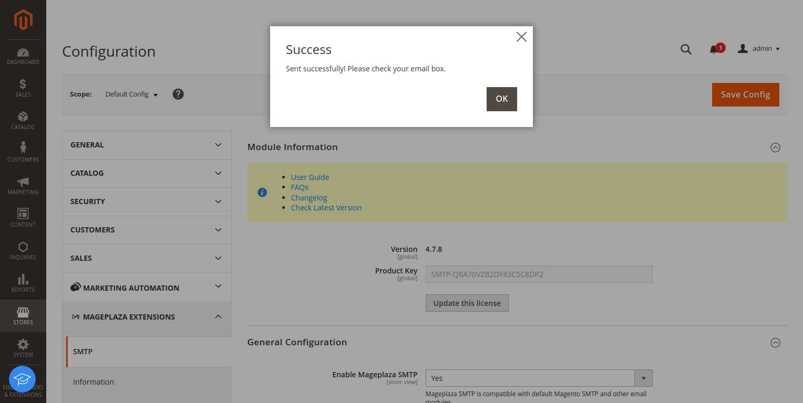
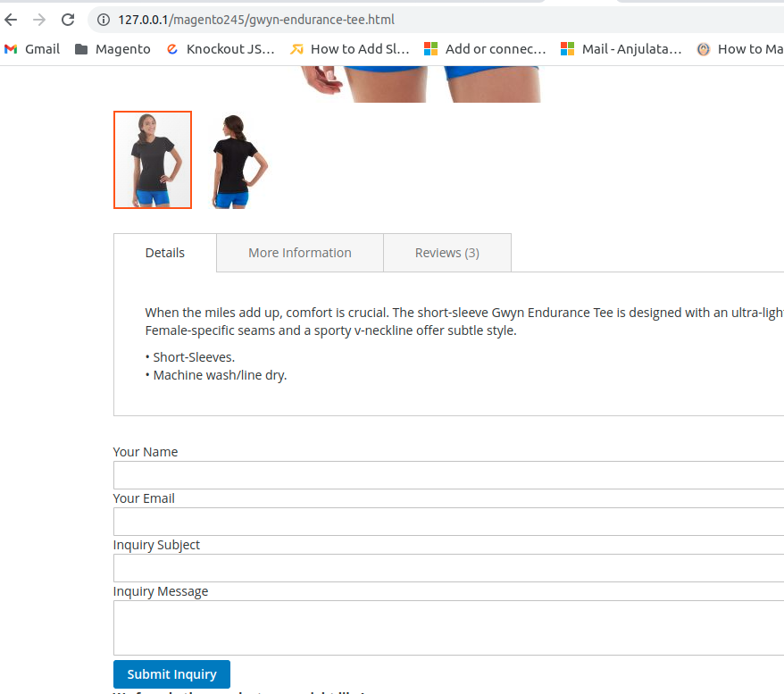
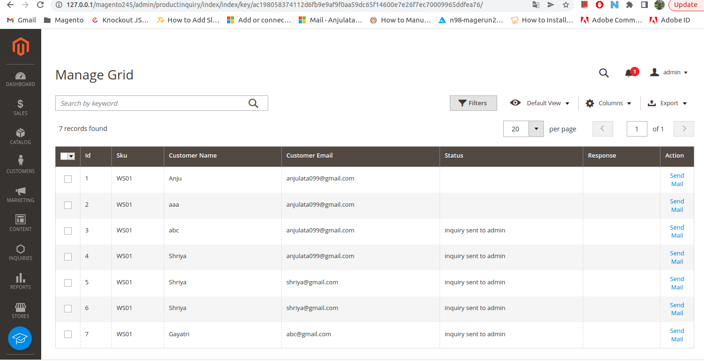
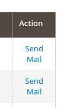
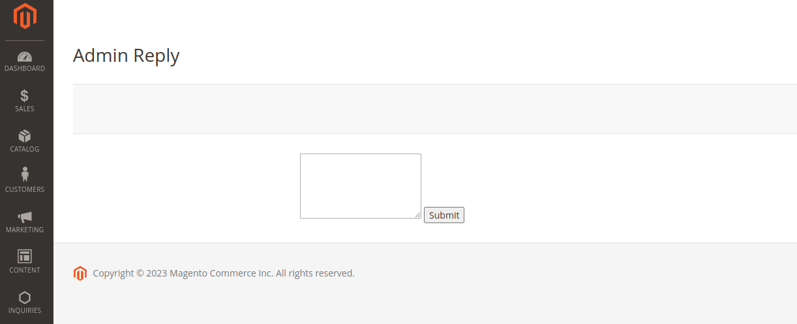
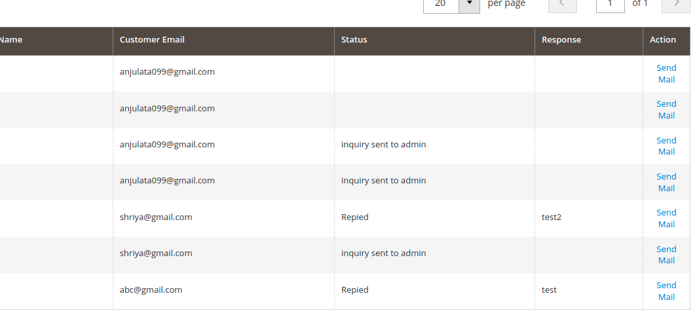

# magento245
module's architecture
Module name: Pwc_ProductInquiry
Step 1: Creat vendor ‘Pwc’ directory and module ‘ProductInquiry’ dirctory.
Step 2: Creat registration.php and module.xml file.
Step 3: Creat db_schema.xml file for the table ‘product_inquiry’ with the 		fields: 
		id
		product_id
		sku
		customer_name
		customer_email
		inquiry_subject
		inquiry_message
		status
		response
		created_at
		updated_at
step 4: execut “php bin/magento setup:upgrade” command and then 	generated whitelist by the command “php bin/magento setup:db-	declaration:generate-whitelist –module-name=Pwc_ProductInquiry”.
Step 5:smtp configuration: installed mageplaza smtp extension 
	For configuring email sending system go to Store->Configuration->MAGEPLAZA EXTENSION->SMTP

step 6: creat product inquiry form that appears on the product detail page.

step 8: On submit for send mail to the admin and save the product inqury 	entry.

Step 9: Admin panel  go to the INQUIRIES->Manage Grid
		we can check here the product inquiry entries.

Step 10: Admin can reply from the grid by clicking “send mail” in Action column.

Step 11: enter reply message and submit. It will send reply to particular customer and updated it in database.

Step 12: Now check it in grid.

Thanks